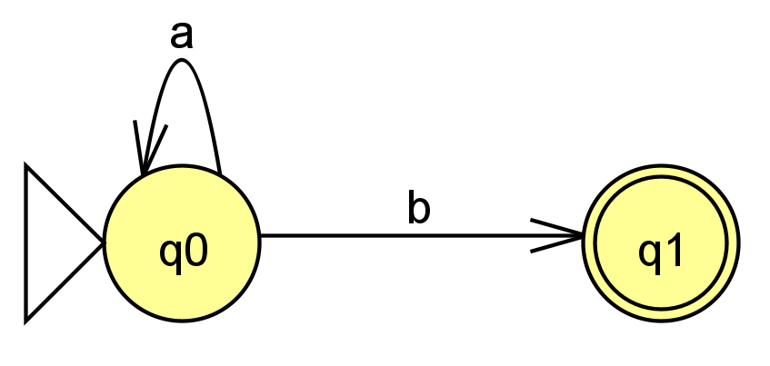

# Beispiel: Die Sprache `a*b`

Als Beispiel soll eine Sprache \\( L \\) dienen, deren Worte aus beliebig vielen "a" gefolgt von
genau einem "b" bestehen soll, also:

\\[
L = \\{ab, aab, aaab, \dots\\}.
\\]

Eine solche Sprache lässt sich mit folgender Grammatik beschreiben:

\\[
\begin{align}
&G = (N, T, P, S)\\\\
\\\\
&N = \\{A, X\\}\\\\
&T = \\{a, b, \varepsilon\\}\\\\
&P = \\{X \rightarrow aAb, A \rightarrow a\vert\varepsilon\\}\\\\
&S = X
\end{align}
\\]

Eingabeworte könnten jedoch auch folgende sein:

\\[
\begin{equation}
E = \\{aaab, aaaabbbbbbbb, ba, bbaa, baa\\}\nonumber
\end{equation}
\\]

Mittels eines deterministischen endlichen Automaten, der
nach \\( G \\) modelliert ist, können wir nun die Eingabeworte auf Zugehörigkeit zur Sprache \\( L \\)
prüfen:

In Worten beschrieben:

  1. Solange das Zeichen "a" vom Eingabeband gelesen wird, bleibe in Zustand \\( q_{0} \\).
  2. Wird Zeichen "b" gelesen, wechsle in Zustand \\( q_{1} \\). Ist dies das letzte Eingabezeichen, so ist das Wort in der Sprache akzeptiert/enthalten.
  3. Ist es nicht das letzte Eingabezeichen, aber der Endzustand erreicht, so ist das Wort *nicht* in der Sprache enthalten.
  4. Ist es das letzte Eingabezeichen aber der Endzustand ist erreicht, so ist das Wort ebenfalls *nicht* in der Sprache enthalten.
