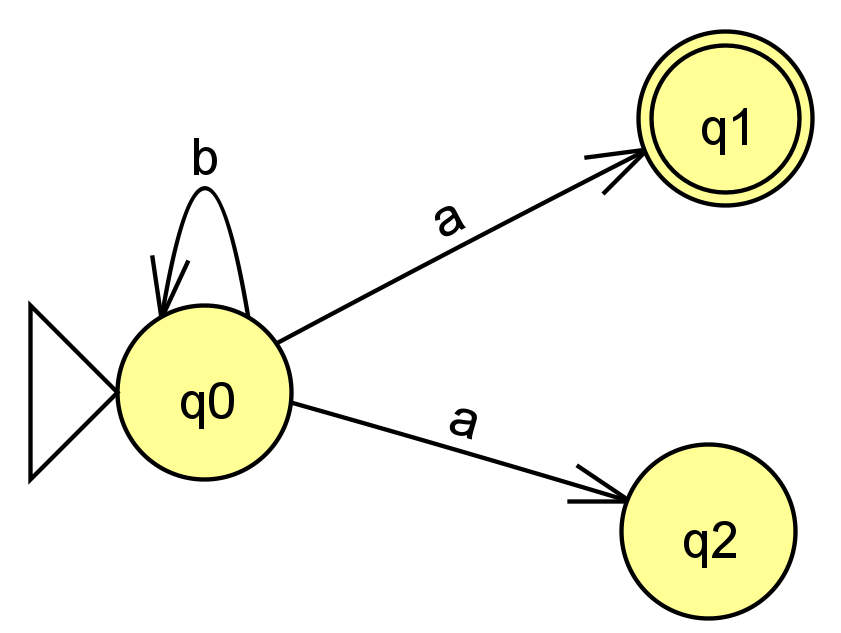

# Nichtdeterministischer endlicher Automat

Im Gegensatz zum DEA ist bei einem geg. Eingabezeichen die Fortsetzung der Ausführung nicht eindeutig (d. h., es ist nicht klar, welcher Übergang gewählt werden soll):

Aus dem Nichtderterminismus folgt:
- Ein NEA kann in mehreren Zuständen zugleich sein
- Es kann mehrere Start- und Endzustände geben
- Eine eindeutige Definition der Übergangsfunktion ist nicht möglich
